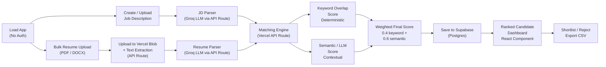

# SkillMatch AI Assistant

# PRD — AI Resume Screening System (Vercel-Ready, No Auth)
**Product Name:** SkillMatch AI  
**Deployment:** Vercel (frontend + API routes), Supabase (Postgres database only)  
**Purpose:** This PRD sections 5–11 are ready to paste directly into Lovable/v0 as build prompts. Sections 1–4 and 12 are reference material.

---

## 1. Problem Statement

Recruiters receive large volumes of resumes per job opening. Manual screening is slow, inconsistent, and risks overlooking qualified candidates. SkillMatch AI automates the first pass: it ingests a Job Description (JD) and a batch of resumes, extracts structured candidate data, compares it against the JD using NLP/ML techniques, and produces a ranked, explainable shortlist — a decision-support tool, not an auto-reject system.

The system runs entirely on Vercel (frontend + serverless functions) with Supabase as a pure database backend. No authentication or sign-up flow — the app works immediately upon load, storing all data in a public Supabase schema.

## 2. Goals & Success Criteria

| Goal | How it's measured |
|---|---|
| Cut manual screening time | Recruiter reviews a ranked list instead of every raw resume |
| Consistent, bias-reduced first pass | Every resume scored against the same rubric |
| Explainable scoring | Every score is backed by matched/missing skills + a written rationale |
| Fully deployable v1 | Works end-to-end on Vercel + Supabase with zero auth complexity |
| Instant usability | Load page → create JD → upload resumes → ranked list (all in one session) |

## 3. Target User

A single recruiter or hiring manager who loads the app, pastes/uploads a JD, uploads resumes, and reviews a ranked shortlist — all in one continuous workflow. No accounts, no persistence required; data stored in Supabase for reference across browser sessions.

## 4. Core User Flow

1. User loads the app → lands on "New Job Description" screen
2. User pastes JD text or uploads JD file (PDF/DOCX)
3. System parses JD → extracts required skills, nice-to-have skills, experience level, education requirement
4. User sees the parsed JD breakdown and confirms it looks correct
5. User uploads resumes (PDF/DOCX, bulk) against that JD via drag-and-drop
6. System extracts text from each resume → parses into structured fields → runs the matching engine
7. User lands on a ranked candidate dashboard, sorted by match score, with matched/missing skills and an AI rationale
8. User can shortlist/reject candidates, view detailed profiles, and export a shortlist CSV

---

## 5. Tech Stack

- **Frontend:** React + TypeScript + Tailwind CSS + shadcn/ui (Lovable defaults)
- **Animation:** Framer Motion for transitions, layout animations, count-ups, and micro-interactions
- **Hosting:** Vercel (for React app and serverless API routes)
- **Database:** Supabase — Postgres (no RLS, single public session; direct client connection via Supabase JS client)
- **Storage:** Vercel Blob Storage (files uploaded to Blob, text extracted server-side, then deleted after processing)
- **AI/NLP Engine:** Groq API (Llama 3.3 70B Versatile, called via Vercel API routes), with a `GROQ_API_KEY` environment variable
- **File Parsing:** `pdfjs-dist` (PDF → text in the browser or Node.js), `docx` (DOCX → text in Node.js) — both available via npm
- **CSV Export:** `papaparse` (for exporting shortlist)

## 6. System Architecture



**Data Flow:**
- JD text → stored in Supabase `job_descriptions` table
- Resume files → uploaded to Vercel Blob Storage → text extracted → parsed → stored in `candidates` table
- Match results → computed server-side → stored in `match_results` table
- All reads/writes use the Supabase JS client from the React frontend (no session required)

---

## 7. Database Schema (Supabase / Postgres)

```sql
-- ============================================
-- TABLE: job_descriptions
-- ============================================
CREATE TABLE IF NOT EXISTS job_descriptions (
  id UUID PRIMARY KEY DEFAULT gen_random_uuid(),
  title TEXT NOT NULL,
  company TEXT,
  raw_text TEXT NOT NULL,
  required_skills TEXT[] DEFAULT '{}',
  preferred_skills TEXT[] DEFAULT '{}',
  min_experience_years NUMERIC,
  max_experience_years NUMERIC,
  education_requirement TEXT,
  role_summary TEXT,
  created_at TIMESTAMPTZ DEFAULT now(),
  updated_at TIMESTAMPTZ DEFAULT now()
);

-- ============================================
-- TABLE: candidates
-- ============================================
CREATE TABLE IF NOT EXISTS candidates (
  id UUID PRIMARY KEY DEFAULT gen_random_uuid(),
  job_description_id UUID REFERENCES job_descriptions(id) ON DELETE CASCADE,
  full_name TEXT,
  email TEXT,
  phone TEXT,
  file_name TEXT NOT NULL,
  blob_url TEXT,
  raw_text TEXT,
  parsed_skills TEXT[] DEFAULT '{}',
  parsed_education JSONB,
  parsed_experience JSONB,
  total_experience_years NUMERIC,
  status TEXT DEFAULT 'pending'
    CHECK (status IN ('pending', 'processing', 'analyzed', 'failed')),
  error_message TEXT,
  created_at TIMESTAMPTZ DEFAULT now(),
  updated_at TIMESTAMPTZ DEFAULT now()
);

-- ============================================
-- TABLE: match_results
-- ============================================
CREATE TABLE IF NOT EXISTS match_results (
  id UUID PRIMARY KEY DEFAULT gen_random_uuid(),
  candidate_id UUID REFERENCES candidates(id) ON DELETE CASCADE,
  job_description_id UUID REFERENCES job_descriptions(id) ON DELETE CASCADE,
  overall_score NUMERIC NOT NULL,
  keyword_score NUMERIC,
  semantic_score NUMERIC,
  matched_skills TEXT[] DEFAULT '{}',
  missing_skills TEXT[] DEFAULT '{}',
  ai_summary TEXT,
  strengths TEXT,
  concerns TEXT,
  rank INT,
  user_status TEXT DEFAULT 'unreviewed'
    CHECK (user_status IN ('unreviewed', 'shortlisted', 'rejected')),
  created_at TIMESTAMPTZ DEFAULT now(),
  updated_at TIMESTAMPTZ DEFAULT now()
);

-- ============================================
-- INDEXES for faster queries
-- ============================================
CREATE INDEX IF NOT EXISTS idx_candidates_job_id ON candidates(job_description_id);
CREATE INDEX IF NOT EXISTS idx_match_results_job_id ON match_results(job_description_id);
CREATE INDEX IF NOT EXISTS idx_match_results_overall_score ON match_results(overall_score DESC);

-- ============================================
-- NO RLS POLICIES (public schema, single session)
-- ============================================
-- Data is session-ephemeral; users can read/write freely within their current browser session.
-- If you want persistence across sessions, consider adding a simple session_id column or using localStorage keys.
```

**Key differences from auth'd version:**
- No `user_id` columns — all data is in one shared namespace
- No RLS policies — the app is single-session/ephemeral by design
- `blob_url` field stores the Vercel Blob URL for potential re-download (optional; can be deleted after parsing)
- `user_status` field added to `match_results` so users can shortlist/reject within a session

---

## 8. Core Features & Functional Requirements

### 8.1 No Authentication
- App loads directly to the main interface
- No login screen, no sign-up
- Data stored in Supabase as a pure database (public read/write within session)
- Optionally, users can save a session ID to localStorage if they want to retrieve previous analyses later

### 8.2 Job Description Management

**Create JD:**
- Text input area (paste text) or file upload button (PDF/DOCX)
- On submit:
  - Extract raw text from file (if uploaded) using `pdfjs-dist` or `docx` npm packages in a Vercel API route
  - Call Vercel API route `/api/parse-jd` with raw JD text
  - Groq LLM prompt: _"Extract from this JD: required_skills (array of strings), preferred_skills (array), min_experience_years (number), max_experience_years (number), education_requirement (string), and role_summary (1-2 sentences). Return ONLY valid JSON."_
  - Store in `job_descriptions` table
  - Display parsed breakdown to user for confirmation

**JD List & Detail:**
- Show all created JDs in a card grid
- Each card shows: title, company, required_skills count, resume count
- Click card → detail view showing the parsed breakdown and an "Upload Resumes" button

### 8.3 Resume Upload & Parsing

**Upload Flow:**
- Drag-and-drop zone accepting PDF/DOCX (max 5MB each, up to 20 at once per upload)
- On file selection:
  1. Create `candidates` rows with `status: pending` for each file
  2. Upload files to Vercel Blob Storage via Vercel API route `/api/upload-resumes`
  3. In the API route:
     - Extract text from each file using `pdfjs-dist` (PDF) or `docx` npm package (DOCX)
     - Call `/api/parse-resume` with extracted text for each resume
     - Groq LLM prompt: _"Parse this resume. Extract: full_name (string), email (string or null), phone (string or null), skills (array of skill names, deduplicated), education (array of {degree, institution, year}), experience (array of {role, company, duration_years, description}), and total_experience_years (number). Return ONLY valid JSON."_
     - Update `candidates` row with parsed data and `status: analyzed`
     - Delete file from Blob Storage (or keep blob_url for audit trail)
  4. Trigger `/api/analyze-match` for each candidate (see 8.4)

**Status Tracking:**
- Real-time UI updates via React hooks polling the Supabase table
- Each candidate row shows: status badge (pending, processing, analyzed, failed), a retry button if failed

### 8.4 AI Matching Engine

**Endpoint:** `POST /api/analyze-match`  
**Input:** `{ candidate_id, job_description_id }`

**Logic (in Vercel API route):**

```typescript
// 1. Fetch candidate and JD from Supabase
const candidate = await supabase
  .from('candidates')
  .select('*')
  .eq('id', candidate_id)
  .single();

const jd = await supabase
  .from('job_descriptions')
  .select('*')
  .eq('id', job_description_id)
  .single();

// 2. Deterministic keyword_score
const matchedRequired = candidate.parsed_skills.filter(skill =>
  jd.required_skills.some(req =>
    normalizeSkill(skill) === normalizeSkill(req)
  )
);
const keyword_score = (matchedRequired.length / jd.required_skills.length) * 100;

// 3. LLM semantic_score
const groqPrompt = `
You are a hiring expert. Compare this resume against this job description.

JD Required Skills: ${jd.required_skills.join(', ')}
JD Preferred Skills: ${jd.preferred_skills.join(', ')}
Candidate Skills: ${candidate.parsed_skills.join(', ')}
Candidate Experience: ${JSON.stringify(candidate.parsed_experience)}

Return ONLY a valid JSON object with these exact fields:
{
  "matched_skills": ["skill1", "skill2"],
  "missing_skills": ["skill3"],
  "semantic_score": 75,
  "rationale": "Brief 2-3 sentence summary of fit",
  "strength": "One key strength",
  "concern": "One key concern"
}
`;

const groqResponse = await fetch('https://api.groq.com/openai/v1/chat/completions', {
  method: 'POST',
  headers: {
    'Authorization': `Bearer ${process.env.GROQ_API_KEY}`,
    'Content-Type': 'application/json',
  },
  body: JSON.stringify({
    model: 'llama-3.3-70b-versatile',
    messages: [{ role: 'user', content: groqPrompt }],
    temperature: 0.3,
    max_tokens: 500,
  }),
});

const groqData = await groqResponse.json();
const parsed = JSON.parse(groqData.choices[0].message.content);
const semantic_score = parsed.semantic_score;

// 4. Weighted overall_score
const KEYWORD_WEIGHT = 0.4;
const SEMANTIC_WEIGHT = 0.6;
const overall_score = (KEYWORD_WEIGHT * keyword_score) + (SEMANTIC_WEIGHT * semantic_score);

// 5. Write to match_results and rank
await supabase
  .from('match_results')
  .upsert([
    {
      candidate_id,
      job_description_id,
      overall_score,
      keyword_score,
      semantic_score,
      matched_skills: parsed.matched_skills,
      missing_skills: parsed.missing_skills,
      ai_summary: parsed.rationale,
      strengths: parsed.strength,
      concerns: parsed.concern,
      user_status: 'unreviewed',
    }
  ]);

// 6. Recalculate ranks for this JD
const allMatches = await supabase
  .from('match_results')
  .select('id, overall_score')
  .eq('job_description_id', job_description_id)
  .order('overall_score', { ascending: false });

for (let i = 0; i < allMatches.data.length; i++) {
  await supabase
    .from('match_results')
    .update({ rank: i + 1 })
    .eq('id', allMatches.data[i].id);
}

return { success: true, overall_score };
```

**Trigger:** Automatically after resume parsing completes, OR via a manual "Re-analyze" button in the detail view.

### 8.5 Candidate Ranking Dashboard

**Display:**
- Table or card grid view of all candidates for a selected JD
- Sorted by `overall_score DESC` (rank visible as badge #1, #2, ...)
- Columns/fields per candidate:
  - Rank badge
  - Name (with click-to-detail)
  - Overall score (large, color-coded: emerald ≥75, amber 50–74, rose <50)
  - Top 3 matched skills (green chips)
  - Missing skills count (amber count badge)
  - Status (shortlisted/rejected/unreviewed)
  - Actions (detail, shortlist, reject)

**Filters & Search:**
- Score range slider (0–100)
- Status filter (unreviewed, shortlisted, rejected)
- Name/email search box
- "Export Shortlist" button → downloads CSV with all shortlisted candidates

**Actions:**
- Shortlist button → updates `match_results.user_status` to `shortlisted`, re-ranks dashboard
- Reject button → updates to `rejected`, removes from default view (toggle to show rejected)
- Detail button → opens slide-over/modal

### 8.6 Candidate Detail View

**Modal / Slide-over panel showing:**
- **Left side:** Parsed resume breakdown
  - Full name, email, phone
  - Skills (all, searchable)
  - Education (degree, institution, year)
  - Experience (role, company, duration, description)
- **Right side:** Match analysis
  - Matched skills (green chips)
  - Missing skills (amber chips)
  - Score breakdown (small bar or radial chart showing keyword vs. semantic contribution)
  - AI rationale (2–3 sentences)
  - Strength (green text block)
  - Concern (amber text block)
- **Footer:** Shortlist / Reject / Mark for Review buttons

### 8.7 Dashboard Home (Optional, Recommended)

**Overview Cards:**
- Total JDs created (this session)
- Total candidates uploaded
- Average match score
- Shortlist count vs. total

**Recent Activity List:**
- "JD 'Senior React Dev' created 5 min ago"
- "5 resumes uploaded for 'Senior React Dev' 2 min ago"
- "Analysis complete for 'Jane Doe' — score 82"

---

## 9. UI/UX Design Requirements

### 9.1 Design System

**Color Palette:**
- **Primary:** Indigo 600 (`#4F46E5`) for buttons, links, active states
- **Secondary:** Violet 500 (`#A78BFA`) for accents and hover states
- **Success/High Match:** Emerald 500 (`#10B981`) for scores ≥75 and matched skills
- **Warning/Medium Match:** Amber 500 (`#F59E0B`) for scores 50–74 and missing skills
- **Danger/Low Match:** Rose 500 (`#F43F5E`) for scores <50
- **Neutral:** Slate 50 (`#F8FAFC`) background, Slate 900 (`#0F172A`) text
- **Border:** Slate 200 (`#E2E8F0`)
- **Dark Mode:** Slate 900 background, Slate 100 text, adjusted semantic colors

**Typography:**
- **Font:** Inter (via Google Fonts)
- **Headings:** Semibold, sizes 2xl (32px), xl (28px), lg (24px)
- **Body:** Regular, 16px line-height 1.5
- **Caption:** 12px, Slate 500
- **Monospace (for skills/tags):** Monaco or SF Mono

**Spacing:** 4px grid (4, 8, 12, 16, 24, 32, 48, 64)

**Shadows:**
- `shadow-sm`: 0 1px 2px rgba(0,0,0,0.05)
- `shadow-md`: 0 4px 6px rgba(0,0,0,0.1)
- `shadow-lg`: 0 10px 15px rgba(0,0,0,0.1)

**Radius:** `rounded-lg` (8px) for most elements, `rounded-xl` (12px) for cards and large buttons

### 9.2 Key Screens & Layout

#### Screen 1: App Shell (Persistent Header)
```
┌─────────────────────────────────────────────────────────────┐
│ SkillMatch AI  [Logo]    [Dark Mode Toggle]  [Help/Info]    │
└─────────────────────────────────────────────────────────────┘
│                                                               │
│  [Main Content Area - changes per screen]                    │
│                                                               │
└─────────────────────────────────────────────────────────────┘
```

#### Screen 2: Landing / New JD
```
┌─────────────────────────────────────────────────────────────┐
│                  CREATE A JOB DESCRIPTION                    │
├─────────────────────────────────────────────────────────────┤
│                                                               │
│  Paste JD text:                                               │
│  ┌───────────────────────────────────────────────────────┐  │
│  │ Senior Full-Stack Engineer...                         │  │
│  └───────────────────────────────────────────────────────┘  │
│                                                               │
│  — OR —                                                       │
│                                                               │
│  Upload JD file:                                              │
│  ┌───────────────────────────────────────────────────────┐  │
│  │ [Drag & drop PDF/DOCX here]                           │  │
│  │ or [Browse files]                                     │  │
│  └───────────────────────────────────────────────────────┘  │
│                                                               │
│  [Previous JDs] ────────────────────────────────────────────│  │
│  ┌──────────────┐  ┌──────────────┐  ┌──────────────┐      │  │
│  │ Senior React │  │ DevOps Eng.  │  │ Product Mgr  │      │  │
│  │ 3 resumes    │  │ 5 resumes    │  │ 2 resumes    │      │  │
│  └──────────────┘  └──────────────┘  └──────────────┘      │  │
│                                                               │
└─────────────────────────────────────────────────────────────┘
```

#### Screen 3: JD Detail (Parsed Breakdown)
```
┌─────────────────────────────────────────────────────────────┐
│ ← Back    Senior React Engineer                [Edit] [✓]   │
├─────────────────────────────────────────────────────────────┤
│                                                               │
│  Company: Acme Inc.                                           │
│                                                               │
│  Required Skills:  [React] [TypeScript] [Node.js] [SQL]     │
│  Preferred Skills: [GraphQL] [Docker]                       │
│                                                               │
│  Experience: 3–5 years                                       │
│  Education: BS in CS or equivalent                          │
│                                                               │
│  Summary: We're looking for a full-stack engineer...        │
│                                                               │
│  ┌─────────────────────────────────────────────────────────┐ │
│  │            [Upload Resumes for this JD]                 │ │
│  └─────────────────────────────────────────────────────────┘ │
│                                                               │
└─────────────────────────────────────────────────────────────┘
```

#### Screen 4: Resume Upload
```
┌─────────────────────────────────────────────────────────────┐
│ ← Back    Upload Resumes (Senior React Engineer)            │
├─────────────────────────────────────────────────────────────┤
│                                                               │
│  ┌───────────────────────────────────────────────────────┐  │
│  │  📁 Drop resumes here (PDF/DOCX)                      │  │
│  │  or click to browse                                   │  │
│  │  Max 20 files, 5MB each                               │  │
│  └───────────────────────────────────────────────────────┘  │
│                                                               │
│  Uploading (3 files):                                         │
│  ┌─────────────────────────────────────────────────────┐    │
│  │ jane_doe_resume.pdf                    ░░░░░░░░░ 85% │   │
│  │ john_smith_resume.pdf                  ░░░░░░░░░░░░ │   │
│  │ alice_chen_resume.pdf                  ░░░░░░ 45%    │   │
│  └─────────────────────────────────────────────────────┘    │
│                                                               │
│  Analyzing resumes...  (3 of 3)                              │
│                                                               │
│  [View Results]                                              │
│                                                               │
└─────────────────────────────────────────────────────────────┘
```

#### Screen 5: Candidate Dashboard (Table View)
```
┌─────────────────────────────────────────────────────────────┐
│ Senior React Engineer  [Score: 0–100 ⊕]  [Status ⊕]         │
│                                           [Search ▼] [Export]│
├─────────────────────────────────────────────────────────────┤
│ Rank │ Name          │ Score  │ Skills (Top 3)  │ Status   │ │
├──────┼───────────────┼────────┼─────────────────┼──────────┤ │
│  1   │ Jane Doe      │ 89 🟢  │ [React][TS][SQL]│ ⭐ ... │ │
│  2   │ John Smith    │ 78 🟢  │ [React][Node]   │ ◯ ...  │ │
│  3   │ Alice Chen    │ 65 🟡  │ [React][GraphQL]│ ◯ ...  │ │
│  4   │ Bob Johnson   │ 52 🟡  │ [React]         │ ◯ ...  │ │
│  5   │ Carol White   │ 31 🔴  │ [Node.js]       │ ✗ ...  │ │
│                                                               │
└─────────────────────────────────────────────────────────────┘
```

#### Screen 6: Candidate Detail (Slide-over)
```
┌─────────────────────────────────────────────────────────────┐
│ ←  Candidate Detail: Jane Doe                           [✕]  │
├─────────────────────────────┬─────────────────────────────┤
│  RESUME                     │  MATCH ANALYSIS             │
├─────────────────────────────┼─────────────────────────────┤
│                             │  Match Score                │
│ Jane Doe                    │  ┌───────────┐              │
│ jane@example.com            │  │    89     │ Excellent   │
│ (555) 123-4567              │  └───────────┘              │
│                             │                             │
│ Skills:                     │  Matched Skills:            │
│ [React] [TypeScript]        │  [React] [TypeScript]       │
│ [Node.js] [SQL]             │  [Node.js] [SQL]            │
│ [GraphQL] [CSS]             │                             │
│                             │  Missing Skills:            │
│ Education:                  │  [Docker]                   │
│ BS Computer Science (2019)  │                             │
│                             │  Score Breakdown:           │
│ Experience:                 │  Keyword: 75%               │
│ Senior Dev @ TechCorp       │  Semantic: 94%              │
│ 2021–present (3 yrs)        │  Overall: 89%               │
│ Led React team of 4...      │                             │
│                             │  Rationale:                 │
│ Full-Stack @ StartupXYZ     │  Jane has strong React and  │
│ 2019–2021 (2 yrs)           │  backend skills. Missing    │
│ Built APIs...               │  Docker experience.         │
│                             │                             │
│                             │  Strength:                  │
│                             │  🟢 Led multiple teams and  │
│                             │  shipped to production      │
│                             │                             │
│                             │  Concern:                   │
│                             │  🟡 No containerization     │
│                             │  experience mentioned       │
│                             │                             │
│ [Shortlist] [Reject] [Mark] │                             │
│                             │                             │
└─────────────────────────────┴─────────────────────────────┘
```

### 9.3 Component Specifications

**Header / Navbar:**
- Fixed top, height 60px, shadow-md
- Logo + app name on left
- Dark mode toggle (sun/moon icon) on right
- Optional: session info or help icon

**JD Card (Grid):**
- Card with soft shadow + border
- Title (bold, lg), company (sm, slate-600), required skills count, candidate count
- Hover: shadow-lg + slight scale-up (1.02)
- Click: navigate to detail

**Resume Upload Dropzone:**
- Large box with dashed border, padding-12, centered content
- Icon (📁), text prompt, supported formats
- On drag-over: border color changes to primary, background tints
- On file drop: files appear in a list below with progress bars

**Progress Bar:**
- Animated fill from 0 to 100% over upload/processing time
- Checkmark icon animates in on completion
- Per-file status (pending, processing, analyzed, failed)

**Candidate Card (Dashboard):**
- Horizontal card, md shadow, border
- Left: rank badge (#1, #2, etc.), name, email
- Center: large score with semantic color (emerald, amber, rose)
- Right: top 3 matched skills as green chips, missing skills as amber count
- Action buttons inline or on hover

**Score Ring / Radial Chart:**
- Animated SVG circle showing keyword % and semantic % contributions
- Center number shows overall score
- Used in detail view and dashboard summary

**Chip / Badge:**
- Inline tag-like element, rounded-full, padding-2 x-3
- Semantic colors: emerald (matched), amber (missing/warning), indigo (generic)

**Toast Notifications:**
- Position: top-right, auto-dismiss 4s
- Slide-in from top-right (Framer Motion)
- Icon + message + auto-dismiss progress bar

---

## 10. Animation & Micro-interaction Spec (Framer Motion)

### 10.1 Page & Route Transitions
- **In:** fade (opacity 0→1) + slide-up (y: 20→0), duration 200ms, easing `easeOut`
- **Out:** fade (opacity 1→0) + slide-down (y: 0→20), duration 150ms
- Applied globally to route changes

### 10.2 Dropzone Interactions
- **Drag-over:** Border color animates to primary (`#4F46E5`), background tints to indigo-50, pulse animation on border
- **File drop:** Files appear with staggered fade-in (40ms per item)
- **Progress bar:** Smooth animated fill from 0% to current progress, checkmark scales-in (1.2→1) on completion

### 10.3 Resume Upload Processing
- **Per-file status indicators:** Pulsing dot animation while `status = processing`, resolves to checkmark or X icon
- **Skeleton loaders:** Shimmer placeholders for dashboard and detail panel while data loads from Supabase
- **Count-up animation:** When a match score completes, the number animates from 0 to final score over 800ms (linear easing)

### 10.4 Candidate List Reordering
- When candidates are re-sorted (e.g., filter applied), Framer Motion's `layout` prop animates reordering instead of hard re-render
- Cards animate to new positions over 300ms, easing `easeInOut`

### 10.5 Card & Button States
- **Hover:** `scale: 1.02`, `shadow: lg`, duration 150ms
- **Press:** `scale: 0.98`, `shadow: md`, duration 100ms
- **Active/Selected:** Primary color background, white text, checkmark icon

### 10.6 Status Change Animation
- Shortlist button → color transition (slate → emerald), icon animates in (checkmark, scale 0.5→1)
- Reject button → color transition (slate → rose), icon animates in (X, scale 0.5→1)

### 10.7 Modals & Slide-overs
- **Open:** Backdrop fades in (0→0.3 opacity), panel slides from right (x: 400→0), duration 300ms
- **Close:** Reversed, duration 200ms

### 10.8 Toast Notifications
- **Enter:** Slide from right (x: 400→0), fade (0→1), duration 250ms
- **Exit:** Slide right (x: 0→400), fade (1→0), progress bar shrinks from full width to 0, duration 250ms
- Auto-dismiss after 4s

### 10.9 Score Reveal Animation
- **Before:** Score component shows skeleton (shimmer)
- **After:** Radial chart animates SVG stroke (0° → 360°), center number counts up (0 → final), duration 1000ms, easing `easeInOut`

### 10.10 Empty & Loading States
- **Empty state:** Illustration + "No candidates yet" message fades in with slight slide-up
- **Loading state:** Multiple skeleton cards animate staggered shimmer (1s loop)

---

## 11. Non-Functional Requirements

### 11.1 File Handling
- Accepted formats: PDF (via `pdfjs-dist`) and DOCX (via `docx` npm package)
- Max file size: 5 MB per file
- Max simultaneous uploads: 20 files
- File validation on client-side with error toast
- Files uploaded to Vercel Blob Storage, deleted after text extraction and parsing
- Graceful fallback: if parsing fails, `status: failed` with error message, retry button available

### 11.2 API Security
- Groq API key stored as Vercel environment variable, never exposed to client
- All Groq calls made from Vercel API routes (server-side only)
- Supabase connection string stored as Vercel environment variable

### 11.3 Performance
- Dashboard loads within 2s for up to 50 candidates
- Lazy-load images (score visualizations, illustrations)
- Debounce search input (300ms)
- Memoize expensive React components (match dashboard, detail view)

### 11.4 Error Handling
- LLM JSON parse failures → fallback to generic "Unable to parse, manual review needed" status
- Network errors → retry toast with "Retry" action, max 3 retries
- Database errors → user-friendly message + support contact link
- File parsing errors (corrupted PDF/DOCX) → descriptive error message

### 11.5 Responsive Design
- Mobile (≤640px): Stacked layout, single-column tables, full-width cards
- Tablet (641px–1024px): 2-column layout, collapsible filters
- Desktop (≥1025px): Full table view, side-by-side panels

### 11.6 Accessibility
- All interactive elements keyboard-accessible (Tab, Enter, Arrow keys)
- Color not the only indicator (use icons, text labels)
- ARIA labels on buttons and modals
- Semantic HTML (button, a, section, etc.)
- Focus outlines visible on all buttons

### 11.7 Data Retention
- Session-based storage (ephemeral by design)
- Optional: add `session_id` column and localStorage to allow users to restore previous sessions
- No automatic cleanup; data persists in Supabase indefinitely (or implement a TTL if needed)

---

## 12. Out of Scope for v1

- Multi-recruiter/team accounts
- ATS integrations (LinkedIn, Indeed, Workday APIs)
- Email notifications
- Non-English resumes or multilingual support
- Video resumes or portfolio links
- Cover letter parsing
- Salary expectation parsing
- Interview scheduling integrations
- Feedback/notes per candidate (can add in v1.1)
- Dark mode (can add as a toggle in v1.1)

---

## 13. Build Order for Vercel/Lovable (Recommended)

### Phase 1: Foundation (Database & Project Setup)
**Paste Section 7 (Database Schema):**
> "Set up this Supabase Postgres schema (run the SQL provided). No RLS policies — it's a single-session ephemeral database. Create the three tables: job_descriptions, candidates, match_results. Also set up a Vercel project with these environment variables: NEXT_PUBLIC_SUPABASE_URL, NEXT_PUBLIC_SUPABASE_ANON_KEY, GROQ_API_KEY, BLOB_READ_WRITE_TOKEN."

**Lovable checklist:**
- [ ] Supabase project created, SQL schema deployed
- [ ] Vercel project linked to GitHub (if using Git) or created standalone
- [ ] Environment variables configured in Vercel dashboard
- [ ] Supabase JS client imported in React app

---

### Phase 2: UI Shell & Navigation (Sections 9.1, 9.2, 9.3)
**Paste Sections 9.1–9.3:**
> "Build the app shell with this design system (colors, typography, spacing). Create these screen skeletons: (1) Landing/New JD, (2) JD Detail, (3) Resume Upload, (4) Candidate Dashboard, (5) Candidate Detail (modal). No functionality yet — just layout and navigation structure. Use Tailwind CSS and shadcn/ui components."

**Lovable checklist:**
- [ ] Header/navbar responsive on mobile/tablet/desktop
- [ ] All 5 screen layouts built (can be empty of functionality)
- [ ] Dark mode toggle wired (even if just visual, data can come later)
- [ ] Navigation between screens works (React Router or Next.js app router)

---

### Phase 3: JD Management (Sections 8.1, 8.2)
**Paste Sections 8.1 and 8.2:**
> "Build JD creation and parsing. Create the 'Create JD' form with text input or file upload (use pdfjs-dist for PDF, docx npm package for DOCX). On submit, call a Vercel API route /api/parse-jd with the raw JD text. The route should use Groq Llama 3.3 70B to extract required_skills, preferred_skills, min_experience_years, max_experience_years, education_requirement, and role_summary. Parse the JSON response and store in the job_descriptions table. Show the parsed breakdown to the user and let them create more or proceed to upload resumes. Implement JD list view (card grid) and JD detail view."

**Lovable checklist:**
- [ ] Form validation (text length, file size)
- [ ] `/api/parse-jd` Vercel serverless function created and tested
- [ ] Groq API integration working (test with a sample JD)
- [ ] Supabase insert working (check job_descriptions table)
- [ ] JD list and detail views display correctly
- [ ] Error handling for parsing failures (toast or error message)

---

### Phase 4: Resume Upload & Text Extraction (Section 8.3 Part 1)
**Paste first part of Section 8.3:**
> "Build the resume upload interface: drag-and-drop zone accepting PDF/DOCX files (max 5MB, up to 20). On file selection, create candidate rows in the candidates table with status='pending' and file metadata. Upload files to Vercel Blob Storage via a Vercel API route /api/upload-resumes. Extract text from each file (use pdfjs-dist for PDF, docx for DOCX) and store raw_text in the candidates table. Update status to 'processing'. Add a real-time progress indicator per file."

**Lovable checklist:**
- [ ] Dropzone UI with drag-over animation
- [ ] File validation (format, size)
- [ ] `/api/upload-resumes` route working
- [ ] Files uploaded to Vercel Blob Storage
- [ ] Text extraction working for PDF and DOCX
- [ ] candidates table populated with raw_text and status
- [ ] Progress bar animates smoothly

---

### Phase 5: Resume Parsing (Section 8.3 Part 2)
**Paste second part of Section 8.3:**
> "Build resume parsing. After text extraction, call a Vercel API route /api/parse-resume with the extracted text. The route should use Groq to extract full_name, email, phone, skills (array), education (array of degree/institution/year), experience (array of role/company/duration_years/description), and total_experience_years. Parse the JSON response and update the candidates row with parsed_education, parsed_experience, parsed_skills, total_experience_years, and status='analyzed'. If parsing fails, set status='failed' with an error_message and provide a retry button."

**Lovable checklist:**
- [ ] `/api/parse-resume` route created and tested
- [ ] Groq resume parsing prompt refined (test with a real resume)
- [ ] Supabase updates working
- [ ] Status transitions are visible in the UI
- [ ] Retry button works for failed resumes
- [ ] Error messages are user-friendly

---

### Phase 6: Matching Engine (Section 8.4)
**Paste Section 8.4:**
> "Build the matching engine. Create a Vercel API route /api/analyze-match that takes candidate_id and job_description_id. Compute a deterministic keyword_score as (matched required skills / total required skills) * 100. Call Groq with both the parsed JD and resume JSON to compute a semantic_score (0–100) and extract matched_skills, missing_skills, ai_summary, strengths, and concerns in JSON. Combine scores with weights (0.4 keyword, 0.6 semantic) to get overall_score. Insert into match_results table and recalculate ranks. Trigger this automatically after resume parsing or via a manual 'Re-analyze' button."

**Lovable checklist:**
- [ ] `/api/analyze-match` route created and tested
- [ ] Keyword score computation working
- [ ] Groq semantic scoring working (test JSON parsing)
- [ ] Weighted score formula correct
- [ ] match_results table populated
- [ ] Ranks recalculated correctly
- [ ] Trigger (automatic after parsing or manual button) working

---

### Phase 7: Candidate Dashboard & Ranking (Sections 8.5, 8.6)
**Paste Sections 8.5 and 8.6:**
> "Build the candidate ranking dashboard. Fetch all candidates and match_results for a selected JD, sorted by overall_score DESC. Display as a table (or card grid for mobile) with rank badge, name, score (color-coded: emerald ≥75, amber 50–74, rose <50), top 3 matched skills (green chips), missing skills count, and status. Add filters: score range slider, status filter, name/email search. Add actions: click name to open detail modal, shortlist button, reject button. Build the detail modal showing the resume on the left and match analysis on the right. Include score breakdown (bar or radial chart), ai_summary, strengths, concerns. Implement shortlist/reject actions (update user_status in match_results)."

**Lovable checklist:**
- [ ] Dashboard table/grid renders correctly
- [ ] Sorting by score works
- [ ] Filters and search working
- [ ] Color-coding of scores correct
- [ ] Detail modal opens/closes smoothly
- [ ] Score visualization (bar or radial chart) displays
- [ ] Shortlist/reject buttons update database and UI
- [ ] Export shortlist button works (downloads CSV with papaparse)

---

### Phase 8: Dashboard Home & Stretch Features (Section 8.7)
**Paste Section 8.7:**
> "Build a home/dashboard screen showing overview stats: total JDs, total candidates, average score, shortlist count. Add a recent activity feed. Optional: add empty states with illustrations, loading skeletons."

**Lovable checklist:**
- [ ] Stats cards display correct counts
- [ ] Activity feed shows recent events
- [ ] Empty states designed
- [ ] Loading states with skeleton shimmer

---

### Phase 9: Polish & Animation (Section 10, All)
**Paste Section 10:**
> "Add Framer Motion animations throughout: page transitions (fade + slide-up), dropzone drag-over effects, upload progress bar animation, processing indicators (pulsing dots), score reveal (count-up + radial animation), candidate list reordering (layout animation), modal open/close (slide from right), toast notifications (slide + fade), button hover/press states (scale). Use the exact timings and easings specified in the animation spec."

**Lovable checklist:**
- [ ] Page transitions feel smooth
- [ ] Dropzone animations working
- [ ] Upload progress visible and animated
- [ ] Score reveal animated
- [ ] List reordering animates smoothly
- [ ] Modals slide smoothly
- [ ] Toasts appear/disappear with animation
- [ ] All buttons have hover/press animations
- [ ] Performance acceptable (no janky animations)

---

### Phase 10: Testing & Deployment
**Before shipping:**
- [ ] Test end-to-end flow: create JD → upload resumes → view results → shortlist
- [ ] Test error cases: bad Groq responses, network errors, corrupted files
- [ ] Test on mobile, tablet, desktop
- [ ] Check Supabase logs for any failed inserts
- [ ] Check Vercel function logs for API errors
- [ ] Validate environment variables are set correctly
- [ ] Test CSV export
- [ ] Load test with 20+ resumes

**Deploy to Vercel:**
```bash
vercel --prod
```

---

## 14. Environment Variables (Vercel)

Create these in your Vercel project settings:

```env
# Supabase
NEXT_PUBLIC_SUPABASE_URL=https://your-project.supabase.co
NEXT_PUBLIC_SUPABASE_ANON_KEY=your-anon-key

# Groq API
GROQ_API_KEY=gsk_your_groq_key_here

# Vercel Blob Storage
BLOB_READ_WRITE_TOKEN=your_vercel_blob_token
```

**Note:** `NEXT_PUBLIC_*` variables are safe to expose to the client. `GROQ_API_KEY` and `BLOB_READ_WRITE_TOKEN` are server-only secrets.

---

## 15. Vercel Deployment Checklist

- [ ] Next.js (or React + Vite) app created
- [ ] `vercel.json` configured (optional, for custom build settings)
- [ ] All dependencies listed in `package.json`: 
  - `react`, `react-dom`, `typescript`
  - `tailwindcss`, `shadcn/ui` (or headless-ui)
  - `framer-motion`
  - `@supabase/supabase-js`
  - `pdfjs-dist`, `docx`
  - `papaparse`
  - `node-fetch` (if needed for API routes)
- [ ] Vercel project linked to Git repo (or using Vercel CLI)
- [ ] All environment variables set in Vercel dashboard
- [ ] Build runs successfully: `vercel build`
- [ ] Local preview works: `vercel dev`
- [ ] Deployment to production: `vercel --prod`
- [ ] Post-deployment smoke test: load app, create JD, upload resume, verify ranking

---

## 16. Sample Groq Prompt Templates

### JD Parsing Prompt
```
You are an expert HR recruiter. Extract key information from this job description and return ONLY valid JSON with no preamble.

Job Description:
{raw_text}

Return a JSON object with exactly these fields:
{
  "required_skills": ["skill1", "skill2", ...],
  "preferred_skills": ["skill3", ...],
  "min_experience_years": number,
  "max_experience_years": number,
  "education_requirement": "string or null",
  "role_summary": "1-2 sentence summary"
}
```

### Resume Parsing Prompt
```
You are an expert resume parser. Extract key information from this resume and return ONLY valid JSON with no preamble.

Resume:
{resume_text}

Return a JSON object with exactly these fields:
{
  "full_name": "string",
  "email": "string or null",
  "phone": "string or null",
  "skills": ["skill1", "skill2", ...],
  "education": [{"degree": "string", "institution": "string", "year": number or null}, ...],
  "experience": [{"role": "string", "company": "string", "duration_years": number, "description": "string"}, ...],
  "total_experience_years": number
}
```

### Matching Prompt
```
You are a hiring expert comparing a resume to a job description. Be concise and accurate.

JD Required Skills: {jd_required}
JD Preferred Skills: {jd_preferred}
Candidate Skills: {candidate_skills}
Candidate Experience: {candidate_experience_summary}

Analyze the match and return ONLY valid JSON with no preamble:
{
  "matched_skills": ["skill1", "skill2", ...],
  "missing_skills": ["skill3", ...],
  "semantic_score": number (0-100),
  "rationale": "2-3 sentence summary of fit",
  "strength": "one key strength",
  "concern": "one key concern or null"
}
```

---

## 17. Next Steps (After v1 Ships)

- **v1.1 Enhancements:**
  - Dark mode toggle (full implementation)
  - Candidate notes/feedback field
  - Bulk reject/shortlist actions
  - Save and resume previous sessions (localStorage + session_id)
  
- **v2 Features:**
  - Multi-recruiter team support
  - ATS integrations (LinkedIn, Indeed)
  - Email notifications
  - Interview scheduling
  - Cover letter parsing
  - Salary expectations parsing

---

## 18. File Structure (Vercel/Next.js Example)

```
skillmatch-ai/
├── pages/
│   ├── api/
│   │   ├── parse-jd.ts
│   │   ├── upload-resumes.ts
│   │   ├── parse-resume.ts
│   │   └── analyze-match.ts
│   ├── _app.tsx
│   ├── index.tsx (landing / new JD)
│   ├── jd/
│   │   ├── [id].tsx (JD detail)
│   │   └── list.tsx (JD list)
│   └── candidates/
│       ├── [jdId].tsx (dashboard)
│       └── [id].tsx (detail)
├── components/
│   ├── Header.tsx
│   ├── JDForm.tsx
│   ├── ResumeDropzone.tsx
│   ├── CandidateDashboard.tsx
│   ├── CandidateDetail.tsx
│   ├── ScoreRing.tsx (visualization)
│   ├── Toast.tsx
│   └── ... (other shared components)
├── lib/
│   ├── supabase.ts (client)
│   ├── groq.ts (API helpers)
│   ├── blob.ts (Vercel Blob helpers)
│   └── utils.ts (helpers)
├── styles/
│   └── globals.css (Tailwind)
├── public/
│   └── illustrations/ (empty states)
├── package.json
├── vercel.json
├── tsconfig.json
└── tailwind.config.js
```

---

## 19. Key Success Metrics (For Your Report)

- **Time to shortlist:** Measure time from upload start to first 5 candidates ranked (target: <3 min for 20 resumes)
- **Match accuracy:** Manual spot-check: do top-ranked candidates match your expectations? (target: top 3 should have high match with JD)
- **User satisfaction:** Does the UI feel fast and responsive? (no janky animations, instant feedback)
- **Error rate:** What % of resume parses fail? (target: <5%)
- **Code quality:** All Groq LLM responses parse cleanly (target: 100%)

---

**End of PRD. All sections 5–11 are ready to paste into Lovable/v0 for phased development.**

This project was built with [Lovable](https://lovable.dev).

## Build with Lovable

Continue developing this project in the [Lovable editor](https://lovable.dev/projects/2298848c-209e-4635-aa2a-8d41bb8f230c).

- **Ship faster**: describe what you want to build and Lovable handles the code.
- **Stay in sync**: every change made in Lovable is committed straight to this repository.
- **Full ownership**: this code is yours. Push to `main` on GitHub and your changes sync back into Lovable, ready for your next prompt.

## Development

Prefer working locally? You need Node.js and npm — [install with nvm](https://github.com/nvm-sh/nvm#installing-and-updating).

```sh
git clone <this-repository-url>
cd <repository-name>
npm i
npm run dev
```
